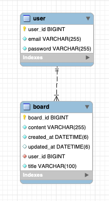

# 원티드 프리온보딩 백엔드 인턴십 - 선발 과제

---

## 지원자의 성명
- 이기태

## 데이터베이스 테이블 구조


## API 명세서
### 1. 사용자 회원가입
- ### Request
    - POST /api/user/join
    ```json
    {
      "email":"dlrlxo999@naver.com",
      "password":"12345678"
    }
    ```
- ### Response
    - 201 CREATED (성공)
  ```json
    {
      "userId": 1
    }
    ```
    - 200 OK (실패 - case1)
    ```json
    {
      "status": 2000,
      "code": "INVALID_EMAIL",
      "message": "이메일 형식이 올바르지 않습니다"
    }
    ```
    - 200 OK (실패 - case2)
    ```json
    {
      "status": 2001,
      "code": "INVALID_PASSWORD",
      "message": "비밀번호 길이가 부족합니다"
    }
    ```
    - 200 OK (실패 - case3)
    ```json
    {
      "status": 2002,
      "code": "DUPLICATE_EMAIL",
      "message": "중복된 이메일입니다"
    }
    ```

### 2. 사용자 로그인
- ### Request
    - POST(x-www-form-urlencoded) /login
    ```json
    {
      "username":"dlrlxo999@naver.com",
      "password":"@@aa0332601"
    }
    ```
- ### Response
    - 200 OK (성공) / header "Authorization" : "Bearer {AccessToken}"
    - 401 Unauthorized (실패)
    - 200 OK (실패 - case1)
    ```json
    {
      "headers": {},
      "body": {
          "status": 2000,
          "code": "INVALID_EMAIL",
          "message": "이메일 형식이 올바르지 않습니다"
    },
      "statusCodeValue": 200,
      "statusCode": "OK"
    }
    ```
  - 200 OK (실패 - case2)
  ```json
  {
    "headers": {},
    "body": {
        "status": 2001,
        "code": "INVALID_PASSWORD",
        "message": "비밀번호 길이가 부족합니다"
  },
    "statusCodeValue": 200,
    "statusCode": "OK"
  }
  ```

### 3. 게시글 생성
- ### Request
    - POST /api/board
    - header "Authorization" : "Bearer {AccessToken}"
    ```json
    {
      "title": "테스트 게시글 제목",
      "content": "테스트 게시글 내용"
    }
    ```
- ### Response
    - 201 CREATED (성공)
    ```json
    {
      "boardId": 2
    }
    ```
  - 403 Forbidden (실패)

### 4. 게시글 목록 조회
- ### Request
    - GET /api/board?page=0&size=4
    - header "Authorization" : "Bearer {AccessToken}"
- ### Response
    - 200 OK (성공)
    ```json
    {
        "content": [
            {
                "boardId": 1,
                "title": "새로운 게시글 제목~!",
                "content": "새로운 게시글 내용",
                "createdAt": "2023-08-03T19:18:25.024519",
                "updatedAt": "2023-08-03T21:05:45.968015"
            },
            {
                "boardId": 3,
                "title": "테스트 게시글 제목1",
                "content": "테스트 게시글 내용1",
                "createdAt": "2023-08-03T21:36:55.938846",
                "updatedAt": null
            },
            {
                "boardId": 4,
                "title": "테스트 게시글 제목2",
                "content": "테스트 게시글 내용2",
                "createdAt": "2023-08-03T21:37:01.737425",
                "updatedAt": null
            },
            {
                "boardId": 5,
                "title": "테스트 게시글 제목3",
                "content": "테스트 게시글 내용3",
                "createdAt": "2023-08-03T21:37:07.128173",
                "updatedAt": null
            }
        ],
        "pageable": {
            "sort": {
                "empty": true,
                "sorted": false,
                "unsorted": true
            },
            "offset": 0,
            "pageNumber": 0,
            "pageSize": 4,
            "paged": true,
            "unpaged": false
        },
        "last": true,
        "totalPages": 1,
        "totalElements": 4,
        "sort": {
            "empty": true,
            "sorted": false,
            "unsorted": true
        },
        "first": true,
        "number": 0,
        "size": 4,
        "numberOfElements": 4,
        "empty": false
    }
    ```
  - 403 Forbidden (실패)

### 5. 특정 게시글 조회
- ### Request
  - GET /api/board/{게시글_ID}
  - header "Authorization" : "Bearer {AccessToken}"

- ### Response
  - 200 OK (성공)
    ```json
    {
      "boardId": 1,
      "title": "새로운 게시글 제목~!",
      "content": "새로운 게시글 내용",
      "createdAt": "2023-08-03T19:18:25.024519",
      "updatedAt": "2023-08-03T21:05:45.968015"
    }
    ```
  - 403 Forbidden (실패 - case1)
  - 200 OK (실패 - case2)
    ```json
     {
       "status": 3000,
       "code": "NOT_FOUND_BOARD",
       "message": "게시글을 찾을 수 없습니다"
     }
    ```

### 6. 게시글 수정
- ### Request
  - PATCH /api/board/{게시글_ID}
  - header "Authorization" : "Bearer {AccessToken}"
    ```json
    {
      "title": "테스트 게시글 제목",
      "content": "테스트 게시글 내용"
    }
    ```
- ### Response
  - 200 OK (성공)
    ```json
    {
      "boardId": 1,
      "title": "테스트 게시글 제목",
      "content": "테스트 게시글 내용",
      "createdAt": "2023-08-03T19:18:25.024519",
      "updatedAt": "2023-08-04T12:12:47.33118"
    }
    ```
  - 403 Forbidden (실패)
  - 200 OK (실패 - case1)
    ```json
      {
        "status": 3000,
        "code": "NOT_FOUND_BOARD",
        "message": "게시글을 찾을 수 없습니다"
      }
    ```
    - 200 OK (실패 - case2)
    ```json
      {
        "status": 3001,
        "code": "NOT_AUTHORIZED_USER",
        "message": "본인의 게시글만 수정 및 삭제할 수 있습니다"
      }
    ```

### 7. 게시글 삭제
- ### Request
  - DELETE /api/board/{게시글_ID}
  - header "Authorization" : "Bearer {AccessToken}"

- ### Response
  - 200 OK (성공)
  - 403 Forbidden (실패)
  - 200 OK (실패 - case1)
    ```json
      {
        "status": 3000,
        "code": "NOT_FOUND_BOARD",
        "message": "게시글을 찾을 수 없습니다"
      }
    ```
    - 200 OK (실패 - case2)
    ```json
      {
        "status": 3001,
        "code": "NOT_AUTHORIZED_USER",
        "message": "본인의 게시글만 수정 및 삭제할 수 있습니다"
      }
    ```

## 필수 작성 내용
- README.md에는 다음과 같은 내용이 포함되어야 합니다:
    - 지원자의 성명
    - 애플리케이션의 실행 방법 (엔드포인트 호출 방법 포함)
    - 데이터베이스 테이블 구조
    - 구현한 API의 동작을 촬영한 데모 영상 링크
    - 구현 방법 및 이유에 대한 간략한 설명
    - API 명세(request/response 포함)

## API 요구 사항
- **과제 1. 사용자 회원가입 엔드포인트**
    - 이메일과 비밀번호로 회원가입할 수 있는 엔드포인트를 구현해 주세요.
    - 이메일과 비밀번호에 대한 유효성 검사를 구현해 주세요.
        - 이메일 조건: **@** 포함
        - 비밀번호 조건: 8자 이상
        - 비밀번호는 반드시 암호화하여 저장해 주세요.
        - 이메일과 비밀번호의 유효성 검사는 위의 조건만으로 진행해 주세요. 추가적인 유효성 검사 조건은 포함하지 마세요.
- **과제 2. 사용자 로그인 엔드포인트**
    - 사용자가 올바른 이메일과 비밀번호를 제공하면, 사용자 인증을 거친 후에 JWT(JSON Web Token)를 생성하여 사용자에게 반환하도록 해주세요.
    - 과제 1과 마찬가지로 회원가입 엔드포인트에 이메일과 비밀번호의 유효성 검사기능을 구현해주세요.
- **과제 3. 새로운 게시글을 생성하는 엔드포인트**
- **과제 4. 게시글 목록을 조회하는 엔드포인트**
    - 반드시 Pagination 기능을 구현해 주세요.
- **과제 5. 특정 게시글을 조회하는 엔드포인트**
    - 게시글의 ID를 받아 해당 게시글을 조회하는 엔드포인트를 구현해 주세요.
- **과제 6. 특정 게시글을 수정하는 엔드포인트**
    - 게시글의 ID와 수정 내용을 받아 해당 게시글을 수정하는 엔드포인트를 구현해 주세요.
    - 게시글을 수정할 수 있는 사용자는 게시글 작성자만이어야 합니다.
- **과제 7. 특정 게시글을 삭제하는 엔드포인트**
    - 게시글의 ID를 받아 해당 게시글을 삭제하는 엔드포인트를 구현해 주세요.
    - 게시글을 삭제할 수 있는 사용자는 게시글 작성자만이어야 합니다.